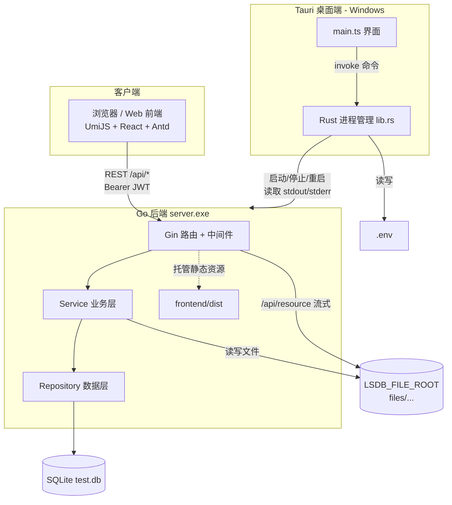
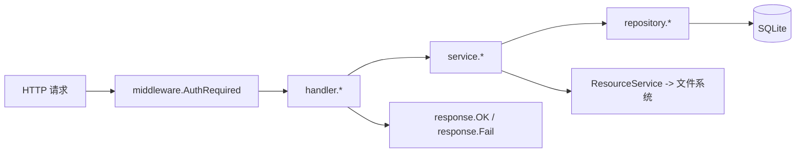

# LSDB 档案 / 资料管理系统

> 一个由 **Go 后端 + UmiJS Web 前端 + Tauri 桌面端** 组成的私有档案 / 资料库系统。

[]()
[]()
[]()

## 📚 文档导航

| 文档 | 内容 |
| --- | --- |
| 本 README | 项目简介、功能、技术栈、目录结构、系统架构、核心模块 |
| [docs/API.md](docs/API.md) | 数据模型 / 数据库设计、完整接口文档 |
| [docs/DEPLOY.md](docs/DEPLOY.md) | 配置说明、构建与部署 |
| [docs/DEVELOPMENT.md](docs/DEVELOPMENT.md) | 本地开发指南、测试、开发规范、FAQ、优化建议、待补充信息 |
| [frontend/README.md](frontend/README.md) | 前端子项目说明（路由、认证、构建） |
| [desktop/README.md](desktop/README.md) | 桌面端子项目说明（托盘、进程管理、构建） |

> 说明：文中标注「根据代码推测」为依据源码推断，「项目中未明确发现」表示现有代码 / 配置无对应依据，需开发者确认。

---

## 1. 项目简介

**LSDB** 是一个**档案 / 资料管理系统**，用于对带有多级分类（base / category / subcategory）、标签、图片、视频等媒体资源的「档案条目（item）」进行检索、浏览、收藏与管理。

项目由三个子项目组成：

- **backend（Go 后端）**：基于 Gin + SQLite 的 REST API 服务，负责认证、档案检索、收藏、角色信息、静态资源（图片/视频）读取与上传等。
- **frontend（Web 前端）**：基于 UmiJS Max + React + Ant Design 的管理与浏览界面，提供登录、档案搜索、详情浏览、图片画廊、视频播放、收藏、角色查看、系统工具等功能。
- **desktop（Tauri 桌面端）**：基于 Tauri 2 + Rust 的 Windows 桌面管理程序，用于在本机以托盘方式启动、停止、重启同目录下的 `server.exe`（后端），并查看日志、编辑 `.env`。

**典型使用场景（根据代码推测）**：

- 个人 / 小团队在 Windows 机器上私有部署的资料库（如壁纸库、影像资料库等，配置中出现 `wallpaper` 等示例分类）。
- 后端打包为 `server.exe`，与前端静态资源、`.env` 一起放在同一目录，由桌面端一键托管运行；用户通过浏览器或桌面承载的前端访问。
- 资源以「文件目录树」形式存放在 `LSDB_FILE_ROOT` 下，数据库仅保存元数据，通过 `/api/resource` 按路径流式读取媒体文件（支持 Range，可播放视频）。

---

## 2. 功能概览

**认证与用户**
- 用户注册（用户名唯一，密码 bcrypt 哈希，长度 ≥ 6）
- 用户登录（返回 JWT Bearer Token）
- 获取当前登录用户信息，并在 Token 即将过期时自动刷新（滑动续期）
- 登出（JWT 无状态，服务端直接返回成功）

**档案（Item）管理**
- 档案列表查询：支持 base / category / subcategory / keyword / tag / dateFrom / dateTo / type / sort / 分页 / 收藏筛选；`matchMode=or` 时 keyword/tag/category 之间 OR 匹配，默认 AND
- 档案详情查询：返回 tagList、imgList（含宽高、宽/窄图分组）、fileList、视频缩略图等派生字段
- 创建档案、更新档案（部分字段更新，未提供字段不更新）
- 标签聚合、头像派生（`avatar` / `avatarSrc`）、图片宽高自动解析（jpeg/png/gif/webp）

**收藏（Favorite）**
- 收藏 / 取消收藏（软删除 `expired=1`，再次收藏可恢复）
- 收藏列表（复用列表接口的 `favi=true`）

**角色（Role）**
- 角色详情：解析 `name`（分号分隔）为 `nameList`，解析 `images`（`name@image.jpg`）为 `imageList`
- 列表查询时按查询标签匹配角色并返回 `roleList`（带头像 URL）

**资源（Resource）**
- 公开读取媒体文件（图片/视频），支持 Range 流式请求与默认兜底图（`force=true`）
- 鉴权后上传 / 删除资源文件，路径穿越防护

**系统命令（Command，仅 Windows）**
- 打开资源目录（`opendir`，限制在 `LSDB_FILE_ROOT` 内）、关机 / 重启主机

**前端能力**
- 多语言（zh-CN / en-US）、响应式布局、ProComponents 表单搜索
- 图片画廊（photoswipe）、视频播放（xgplayer）、档案编辑抽屉、标签编辑、CPU 监控图表（`GET /api/pc`）

**桌面端能力**
- 托盘常驻，启停 / 重启后端 `server.exe`（隐藏控制台窗口启动）
- 实时显示后端 stdout/stderr 日志、查看与编辑同目录 `.env`
- `AUTO_RUN_SERVER=true` 时自动拉起后端；关闭窗口隐藏到托盘，退出时自动停止其启动的后端

---

## 3. 技术栈

### 后端（backend）
| 类别 | 技术 | 版本（来自 `go.mod`） |
| --- | --- | --- |
| 语言 | Go | 1.26 |
| Web 框架 | gin-gonic/gin | v1.11.0 |
| 数据库 | SQLite（纯 Go 驱动 modernc.org/sqlite） | v1.38.2 |
| JWT | golang-jwt/jwt/v5 | v5.3.0 |
| 密码哈希 | golang.org/x/crypto（bcrypt） | v0.41.0 |
| 图片尺寸解析 | golang.org/x/image（webp）+ 标准库 image | v0.28.0 |

### 前端（frontend）
| 类别 | 技术 | 版本（来自 `package.json`） |
| --- | --- | --- |
| 框架 | @umijs/max（UmiJS Max 4） | ^4.6.39 |
| UI 库 | antd | ^6.3.5 |
| 组件库 | @ant-design/pro-components | 3.1.1-1 |
| 视图层 | react / react-dom | 18.2.0 |
| 图片画廊 | photoswipe / react-photoswipe-gallery | ^5.4.4 / ^3.0.2 |
| 视频播放 | xgplayer | 3.0.24 |
| 图表 | chart.js / react-chartjs-2 | ^4.5.1 / ^5.3.1 |
| 语言 / 包管理 | TypeScript ^5.0.3 / pnpm | - |

> 注：`package.json` 含 `bcryptjs`、`jsonwebtoken`，但实际认证由后端完成；`src/utils/jwt.ts`、`prisma.ts` 可能为脚手架遗留（根据代码推测，需确认）。

### 桌面端（desktop）
| 类别 | 技术 | 版本 |
| --- | --- | --- |
| 框架 | Tauri | 2.x |
| 语言 | Rust（edition 2021）+ TypeScript | - |
| 前端构建 | Vite | ^6.0.0 |

### 构建 / 运行环境
- 构建脚本：`build.ps1`（Windows PowerShell）
- 部署形态：后端 `server.exe` + 前端静态 `dist` + 桌面端可执行文件，统一输出到 `build/`
- 运行平台：**Windows**（命令模块与桌面端为 Windows 专用；后端本体为纯 Go，理论可跨平台）

---

## 4. 项目目录结构

```text
lsdb-go/
├─ build.ps1                     # 一键构建脚本（Frontend/Backend/Desktop -> build/）
├─ README.md                     # 本文件
├─ docs/                         # 拆分文档
│  ├─ API.md                     # 数据模型 + 接口文档
│  ├─ DEPLOY.md                  # 配置 + 构建部署
│  └─ DEVELOPMENT.md             # 开发/测试/规范/FAQ/优化
├─ backend/                      # Go 后端
│  ├─ cmd/server/main.go         # 程序入口
│  ├─ internal/
│  │  ├─ app/app.go              # 依赖装配、路由注册、前端静态资源托管
│  │  ├─ config/config.go        # .env + 环境变量 + 默认值 加载
│  │  ├─ database/database.go    # SQLite 打开与启动迁移
│  │  ├─ model/model.go          # 数据模型与请求/查询结构
│  │  ├─ repository/             # 数据访问层（user/item/role/favorite）
│  │  ├─ service/                # 业务逻辑层
│  │  ├─ handler/                # Gin HTTP 处理器
│  │  ├─ middleware/auth.go      # JWT 鉴权中间件
│  │  └─ response/response.go    # 统一响应封装
│  ├─ go.mod / go.sum
│  ├─ .env / .env.example        # 后端配置
│  ├─ README.md / PLAN.md        # 后端说明与设计文档
│  └─ doc/doc.md                 # 设计细节
├─ frontend/                     # UmiJS Max + React 前端
│  ├─ README.md                  # 前端子项目说明
│  ├─ .umirc.ts                  # Umi 配置（路由/代理/布局/国际化）
│  ├─ package.json / LICENSE / vercel.json
│  └─ src/
│     ├─ app.tsx                 # 运行时配置
│     ├─ constants/ services/ models/ pages/ components/ utils/
│     └─ .umi / .umi-production  # Umi 自动生成产物（勿改）
└─ desktop/                      # Tauri 桌面端
   ├─ README.md                  # 桌面端子项目说明
   ├─ index.html / src/main.ts   # 桌面端前端（原生 TS，调用 Tauri 命令）
   ├─ package.json / vite.config.ts
   └─ src-tauri/
      ├─ src/lib.rs              # 核心：进程管理、日志流、托盘、读写 .env
      ├─ src/main.rs / Cargo.toml
      ├─ tauri.conf.json
      └─ capabilities/default.json
```

> `frontend/src/.umi` 与 `.umi-production` 为 UmiJS 编译生成的中间代码，**不应手动修改**。

---

## 5. 系统架构说明

整体为「前后端分离 + 桌面托管」架构：前端通过 `/api/*` 调用后端；后端读写 SQLite 与文件系统资源，并可托管前端静态资源；桌面端作为「进程管理器」托管后端 `server.exe`。



后端内部分层（典型请求链路）：



---

## 6. 核心模块说明

### 6.1 后端
- **app（`internal/app/app.go`）**：`New()` 加载配置 → 打开并迁移数据库 → 装配 repository/service/handler → 注册路由 → 托管前端静态资源。路由分「公开」与「鉴权组」；`registerFrontend` 托管 `dist/` 静态文件，无扩展名路径回退 `index.html`（SPA），带扩展名且未命中的资源返回 404，并防路径穿越。
- **config**：配置优先级 `.env` 文件 > 系统环境变量 > 默认值；自带轻量 `.env` 解析。
- **database**：`Open` 打开 SQLite（GORM + `glebarez/sqlite`，纯 Go 无 CGO）并 `SetMaxOpenConns(1)`；`Migrate` 通过 `AutoMigrate` 创建 `user/items/role/itemfavi` 四表。
- **model**：`ListField` 自定义 JSON 解析，兼容「字符串 / 字符串数组 / 对象数组」，`JoinWrapped` 生成 `;a;b;` 包裹格式匹配 `LIKE '%;x;%'`。
- **repository**：item（GORM 链式查询、matchMode AND/OR、多值 category IN、收藏 JOIN、排序分页）、user、role、favorite（软删/恢复）。
- **service**：auth（JWT/续期）、item（组装响应与派生字段）、role（标签匹配）、resource（路径解析/穿越防护/图片宽高/URL）、favorite、command（Windows）。
- **handler / middleware / response**：参数解析与错误码映射、Bearer 鉴权、统一响应结构。

### 6.2 前端
- `services/lsdb/client.ts`：封装 `apiRequest`，自动附加 `Authorization: Bearer`（Token 存于 cookie `lsdb_token`），对 401 特殊处理。
- `services/lsdb/LsdbController.ts`：业务 API 封装。
- `app.tsx`：`getInitialState` 拉取当前用户，配置 ProLayout、语言切换与登出。
- `pages/items/index.tsx`：核心档案搜索页（URL query 驱动、localStorage 缓存、滚动恢复）。
- `pages/Tool/index.tsx`：关机/重启与 CPU 监控（`/api/pc`）。

### 6.3 桌面端
- `src-tauri/src/lib.rs`：进程状态管理、启动/停止/重启、日志线程、托盘菜单、窗口关闭隐藏、`AUTO_RUN_SERVER` 自动启动、`read_env/write_env`。
- `src/main.ts`：界面逻辑，`invoke` 调用 Rust 命令，`listen` 接收 `log-line` 与 `server-status` 事件。

---

## 版本与许可证

> 本节依据当前仓库代码与配置整理；**尚未完全统一**，详见 [docs/DEVELOPMENT.md](docs/DEVELOPMENT.md) 待补充项。

| 项目 | 当前状态 |
| --- | --- |
| **仓库名称** | `lsdb-go`（本仓库） |
| **统一版本号** | 未在根目录定义；桌面端为 `0.1.0`（`desktop/package.json`、`tauri.conf.json`、`Cargo.toml`）；前端与后端**未声明版本** |
| **许可证** | 仅 [frontend/LICENSE](frontend/LICENSE)（Apache License 2.0）；根目录及 backend/desktop **无 LICENSE 文件** |
| **维护者** | `wmxy2005`（前端 [package.json](frontend/package.json)、桌面端 [Cargo.toml](desktop/src-tauri/Cargo.toml)） |
| **版权（UI 页脚）** | `Copyright © 2025 By wmxy2005`（[frontend/src/app.tsx](frontend/src/app.tsx)） |
| **源码仓库** | `https://github.com/wmxy2005/lsdb-go` |

**待补充**：根目录统一版本与 LICENSE、统一各子项目版本号。

---

## 快速开始

```powershell
# 1) 后端
cd backend; Copy-Item .env.example .env; go run ./cmd/server   # http://localhost:8080

# 2) 前端
cd frontend; pnpm install; pnpm dev                            # http://localhost:8000

# 3) 桌面端（Windows，需先生成 build/server.exe）
cd desktop; pnpm install; $env:LSDB_SERVER_DIR="..\build"; pnpm tauri dev
```

更多细节见 [docs/DEVELOPMENT.md](docs/DEVELOPMENT.md) 与 [docs/DEPLOY.md](docs/DEPLOY.md)。
