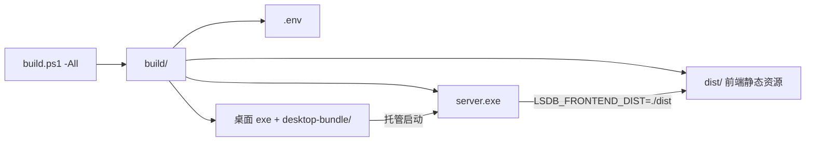

# 配置 / 构建 / 部署文档

> 返回 [README](../README.md) ｜ 相关：[接口文档](API.md) ｜ [开发文档](DEVELOPMENT.md)

## 目录
- [1. 配置说明](#1-配置说明)
- [2. 构建与部署](#2-构建与部署)

---

## 1. 配置说明

### 1.1 后端环境变量（`.env` / 系统环境变量）

配置优先级：**`.env` 文件 > 系统环境变量 > 默认值**。

| 变量 | 默认值 | 说明 |
| --- | --- | --- |
| `LSDB_ADDR` | `:8080` | HTTP 监听地址 |
| `LSDB_DB_PATH` | `backend/data/test.db`（不存在则 `data/test.db`） | SQLite 数据库路径 |
| `LSDB_FILE_ROOT` | `backend/data/files`（同上回退 `data/files`） | 资源文件根目录 |
| `LSDB_FRONTEND_DIST` | 空 | 前端构建产物目录；设为 `../frontend/dist` 或 `./dist` 时由后端托管前端 |
| `LSDB_GIN_MODE` | 空 | Gin 运行模式；可选 `debug`、`release`、`test`，为空时使用 Gin 默认模式选择 |
| `LSDB_JWT_SECRET` | `dev-secret-change-me` | JWT 签名密钥（**生产必须修改**） |
| `LSDB_JWT_EXPIRE_DAYS` | `7` | Token 有效期（天） |
| `LSDB_JWT_REFRESH_DAYS` | `2` | 签发超过该天数后访问 `/auth/current` 触发续期 |
| `AUTO_RUN_SERVER` | 无（false） | 桌面端读取：`true` 则启动桌面端时自动拉起后端 |
| `AUTO_RUN_MINIMIZE` | 无（false） | 桌面端读取：`true` 则启动后隐藏主界面，仅驻留系统托盘 |

局域网访问推荐保持 `LSDB_ADDR=:8080`，然后在其它设备访问 `http://<本机局域网IP>:8080`，例如 `http://192.168.10.87:8080`。不要在其它设备上使用 `http://localhost:8080`，因为 `localhost` 指向访问设备自身。若配置为 `127.0.0.1:8080` 或 `localhost:8080`，后端只接受本机访问。

`.env.example` 内容：
```ini
LSDB_ADDR=:8080
LSDB_DB_PATH=data/test.db
LSDB_FILE_ROOT=data/files
LSDB_FRONTEND_DIST=../frontend/dist
LSDB_GIN_MODE=release
LSDB_JWT_SECRET=dev-secret-change-me
LSDB_JWT_EXPIRE_DAYS=7
LSDB_JWT_REFRESH_DAYS=2
AUTO_RUN_SERVER=true
AUTO_RUN_MINIMIZE=true
```

### 1.2 前端配置
- `.umirc.ts`：
  - 开发代理：`/api` → `http://localhost:8080`
  - 路由：`/` 重定向 `/items`；`/items`、`/items/role`、`/items/:itemId`、`/tool`、`/login`
  - 国际化默认 `zh-CN`；包管理器 `pnpm`
- `constants/config.ts`：`apiUrl`（默认空，走同源/代理）、`tokenExpired`（7 天）、`resBaseList`/`resTypeList` 等业务示例数据。
- `vercel.json`：Vercel 部署配置（存在，内容未在本文档展开）。

### 1.3 数据库维护脚本

在 `backend/` 目录运行，默认使用 `.env` 中的 `LSDB_DB_PATH`（路径优先级与主程序一致；脚本支持命令行参数覆盖）。

- `go run scripts/migrate_test_db.go` — 旧库 schema 对齐与 `itemfavi` 唯一索引
- `go run scripts/verify_test_db.go` — 抽样验证表结构与数据
- `go run scripts/smoke_test_db.go` — GORM 读写冒烟测试

生产环境迁移前请备份数据库文件。详见 [开发文档 §1.6](DEVELOPMENT.md#16-数据库维护脚本)。

### 1.4 桌面端配置
- `tauri.conf.json`：窗口 980×720、`devUrl=http://localhost:1420`、`beforeDevCommand=npm run dev`、`frontendDist=../dist`、打包 `targets: all`。
- 运行时目录：调试构建可用 `LSDB_SERVER_DIR` 指定 `server.exe`/`.env` 所在目录；正式构建固定为可执行文件自身所在目录。

### 1.5 端口
| 服务 | 端口 | 备注 |
| --- | --- | --- |
| 后端 | `8080` | `LSDB_ADDR` |
| 前端 dev | `8000` | UmiJS 默认（未显式配置，根据 Umi 默认推测） |
| 桌面端 dev 前端 | `1420` | Vite，见 `tauri.conf.json` |

Windows 局域网访问排查：

```powershell
netstat -ano | findstr :8080
ipconfig
```

确认 Windows Defender Firewall 允许 `server.exe` 入站，或开放 TCP `8080` 入站端口。若使用 `LSDB_ADDR=:80`，启动可能需要管理员权限，也可能被 IIS、Apache、Nginx 等服务占用。

---

## 2. 构建与部署

### 2.1 一键构建脚本 `build.ps1`（Windows PowerShell）
```powershell
# 交互式选择
powershell -ExecutionPolicy Bypass -File .\build.ps1

# 非交互
powershell -ExecutionPolicy Bypass -File .\build.ps1 -All
powershell -ExecutionPolicy Bypass -File .\build.ps1 -Frontend
powershell -ExecutionPolicy Bypass -File .\build.ps1 -Backend
powershell -ExecutionPolicy Bypass -File .\build.ps1 -Desktop
```

脚本行为：
- **Frontend**：`npm run build` → 拷贝 `frontend/dist` 到 `build/dist`
- **Backend**：`go build -o build/server.exe ./cmd/server`；从 `.env`(或 `.env.example`) 生成 `build/.env`，并强制写入 `LSDB_FRONTEND_DIST=./dist`
- **Desktop**：`npm run tauri build` → 拷贝桌面 exe 与 `bundle` 到 `build/`（`desktop-bundle`）
- 产物统一在 `build/`：`server.exe`、`.env`、`dist/`、桌面可执行文件、`desktop-bundle/`

### 2.2 部署形态（推荐）
1. 执行 `build.ps1 -All` 生成 `build/`。
2. 将 `build/` 整体分发到目标 Windows 机器（含 `server.exe`、`.env`、`dist/`、数据库与 `files/` 资源、桌面 exe）。
3. 直接运行桌面 exe（托盘托管后端），或直接运行 `server.exe`。
4. 后端通过 `LSDB_FRONTEND_DIST=./dist` 托管前端；本机浏览器访问 `http://localhost:8080`，局域网设备访问 `http://<本机局域网IP>:8080`。
5. 静态托管规则：`dist/` 内存在的文件直接返回；无扩展名路径（如 `/items/1`）回退 `index.html`（SPA）；带扩展名且未命中的资源（如 `/favicon.ico`）返回 404。



### 2.3 前端独立部署（Vercel）
- 仓库含 `frontend/vercel.json`，前端可独立部署到 Vercel（需将 `apiUrl` 指向实际后端，并处理跨域，根据代码推测）。

### 2.4 其它
- 未发现 Docker / docker-compose / Nginx / CI（GitHub Actions 等）配置（项目中未明确发现）。
- 桌面端打包目标为 Windows（`shutdown`/`explorer`/`server.exe` 等均为 Windows 语义）。
- ⚠️ 生产部署前务必修改 `LSDB_JWT_SECRET`，并确认 `LSDB_DB_PATH` 指向的数据库目录可写、`LSDB_FILE_ROOT` 资源目录已就位；空库首次启动时 GORM `AutoMigrate` 会自动建表。旧版数据库需先运行 `migrate_test_db.go`（详见 [开发文档](DEVELOPMENT.md)）。
